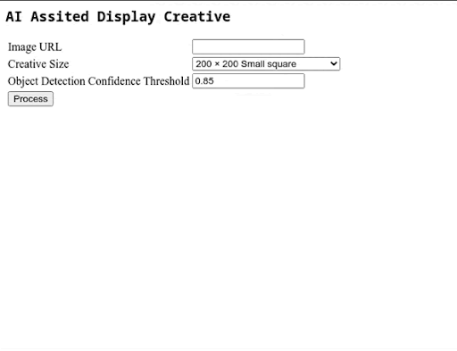

**Disclaimer: This is not an official Google product.**

# AI Assisted Display Creative

This solution assists to create HTML5 multi product display creatives ready for activation in
Google DV360.
Using Google Vision AI, different products are identified within the image for click to product landing page.

## Prerequisites

Google cloud user with privileges over App Engine and Vision API (ideally Owner role)

- [gcloud CLI](https://cloud.google.com/sdk/docs/install) installed
- Latest version of Terraform installed
- Python version >= 3.8.1 installed
- Python Virtualenv installed
- [Obtain the Google Cloud Vision API key](https://cloud.google.com/vision/docs/setup)

## How to deploy

- Clone this repository onto your local machine
by running ```git clone http://github.com/google/ai_assisted_display_creative.git```
- Navigate to the project folder ```cd ai_assisted_display_creative/```
- Make sure you edit the ```variables.tf``` file with all the relevant values.
- Run in the shell: ```gcloud auth application-default login``` [more details here](https://cloud.google.com/docs/authentication/api-keys?hl=en&visit_id=638212395469740489-1395798417&rd=1) and follow the steps to copy the code.
- Set the environment variable ```GOOGLE_APPLICATION_CREDENTIALS``` to the generated user key file after running the command above. It says something similar to ```Credentials saved to file: [/usr/local/xxx/home/xxxx/.config/gcloud/application_default_credentials.json]```. An example of the export command would be: ```export GOOGLE_APPLICATION_CREDENTIALS=/usr/local/xxx/home/xxxx/.config/gcloud/application_default_credentials.json```
- Run in the shell: terraform init
- Run in the shell: terraform apply
- Type `yes` and hit return
- When deployment is complete, the URL must be displayed in the shell. Somtehing like:
Deployed service [default] to [`https://<my-project>.<region>.r.appspot.com`]
- Open a browser and go to [`https://<my-project>.<region>.r.appspot.com`]

## How to run it in your local computer

- Clone this repository onto your local machine
by running ```git clone http://github.com/google/ai_assisted_display_creative```
- Navigate to the project folder ```cd ai_assisted_display_creative/```
- Run in the shell: ```gcloud auth application-default login``` [more details here](https://cloud.google.com/docs/authentication/api-keys?hl=en&visit_id=638212395469740489-1395798417&rd=1) and follow the steps to copy the code.
- Set the environment variable ```GOOGLE_APPLICATION_CREDENTIALS``` to the generated user key file after running the command above. It says something similar to ```Credentials saved to file: [/usr/local/xxx/home/xxxx/.config/gcloud/application_default_credentials.json]```. An example of the export command would be: ```export GOOGLE_APPLICATION_CREDENTIALS=/usr/local/xxx/home/xxxx/.config/gcloud/application_default_credentials.json```
- Make sure you replace the ```vision_api_key``` value in  the ```variables.tf``` file. No other values are required
- Run in the shell: sh run_local.sh
- Open a browser and go to [localhost:8000](http://localhost:8000)

## How to use the tool

Once the browser is opened and the webpage with the form appears:

1. Paste the image URL, it must be of public access or the bot will not be able to retrieve it.
2. Indicate the right size of the uploaded creative. The process will cut on the width if greater but it will not rescale.
3. Select a low threshold to detect as many objects as possible i.e 0.1.
4. Click "Process" button.
5. You can mouse over the circles in the image to show the label of the object.
6. Add the URLs for the landings of the objects you want to keep. The blank ones will be removed.
7. Adjust circles size and color.
8. Click "Update" button, now the creative should contain just the desired objects.
9. If happy with the result, click on "Generate Creative" and a zip file will download automatically. If not happy with the resultsgo back to step 5.




## Ouput

The output is a zip file containing all the required files:
- html file
- images/ folder with all the referenced files

## Generated Cloud Artefacts

- Google App Engine

## Author

- Jaime Martinez (jaimemm@)
